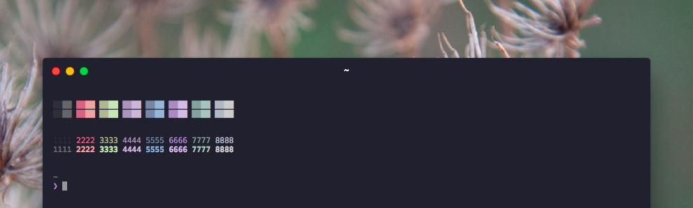

# phallus-snazzy

> [Hyper](https://hyper.is) colorscheme based on .Xdefaults from phallus

## Install

Add `hyper-phallus` to the plugins list in your `~/.hyper.js` config file.

## Tip

To get the exact same look as in the screenshot, you need to use the [Pure](https://github.com/sindresorhus/pure) prompt, DejaVu Sans Mono font, and the [zsh-syntax-highlighting](https://github.com/zsh-users/zsh-syntax-highlighting) plugin to have commands highlighted.

## Related

- [phallus](https://github.com/Stelgard/phallus) - iTerm2 version

## License

MIT © [Samuele Cioni](http://samuele.io)
